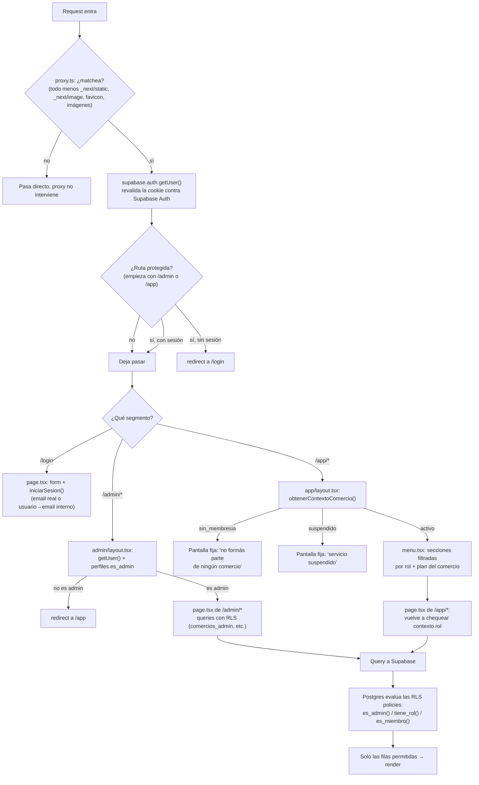
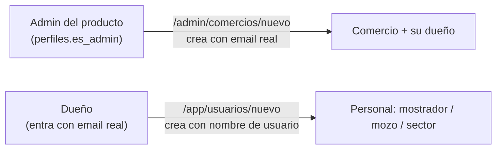

# Arquitectura — SaaS gastronómico

Este documento es el mapa del código: para dónde mirar cuando algo falla, cómo está armada una pantalla típica, y por qué las cosas están donde están. Complementa a `docs/SCHEMA.md` (que describe las tablas, los roles y las reglas de negocio) — acá el foco es el código de `src/`, no el modelo de datos.

Si algo de lo que describe este documento cambia (una carpeta se reorganiza, un patrón deja de usarse), actualizalo en el mismo cambio: un mapa desactualizado es peor que no tener mapa.

## Índice

1. [Mapa de carpetas](#mapa-de-carpetas)
2. [El recorrido de una request](#el-recorrido-de-una-request)
3. [Las capas de seguridad](#las-capas-de-seguridad)
4. [Patrón repetido: cómo está armado un ABM](#patrón-repetido-cómo-está-armado-un-abm)
5. [Modelo de acceso](#modelo-de-acceso)
6. [Guía de diagnóstico](#guía-de-diagnóstico)

---

## Mapa de carpetas

```
src/
├── proxy.ts                    # "Middleware" (Next 16 lo renombró). Corre en casi toda
│                                # request. Único trabajo: refrescar la sesión y redirigir
│                                # a /login si falta en una ruta protegida.
│
├── app/                        # Next.js App Router: cada carpeta = un segmento de URL
│   ├── page.tsx                # "/": sin pantalla propia, solo redirige según quién sos
│   │                           # (sin sesión → /login, admin → /admin, resto → /app).
│   ├── layout.tsx              # Shell HTML + fuentes. Todavía el de create-next-app
│   │                           # (lang="en", título "Create Next App") — no se tocó.
│   ├── error.tsx               # Error boundary de TODA la app (/, /login, /admin, /app:
│   │                           # ninguno tiene un error.tsx propio entre éste y ellos).
│   │
│   ├── (auth)/login/           # Route group: el "(auth)" no aparece en la URL → es /login.
│   │   ├── page.tsx            # Form (Client Component) con useActionState.
│   │   └── actions.ts          # iniciarSesion(): email o nombre de usuario + contraseña.
│   │
│   ├── admin/                  # Panel del equipo del producto (perfiles.es_admin = true).
│   │   ├── layout.tsx          # Guard: sesión + es_admin. Header común a todo /admin.
│   │   ├── page.tsx            # Listado de comercios.
│   │   └── comercios/
│   │       ├── nuevo/          # Alta de comercio + su dueño (Auth + rollback).
│   │       └── [id]/           # Edición de un comercio (no el slug: no se puede cambiar).
│   │
│   └── app/                    # La app que usa el comercio (dueño + su personal).
│       ├── layout.tsx          # Guard: obtenerContextoComercio(), arma el menú.
│       ├── menu.tsx             # Navegación lateral (Client Component, sabe qué link
│       │                       # está activo con usePathname).
│       ├── page.tsx             # Home de /app.
│       ├── carta/               # ABM sectores → categorías → productos (+ adicionales)
│       │                       # y la vista previa de lo que ve el cliente.
│       ├── usuarios/            # ABM del personal del comercio (solo rol duenio).
│       ├── mesas/page.tsx       # Placeholder — sprints 3 a 6, ver docs/SCHEMA.md.
│       ├── pedidos/page.tsx     # Placeholder — ídem.
│       └── sector/[id]/page.tsx # Placeholder con autorización real ya armada (dueño o
│                                # rol sector con ese sector asignado), sin funcionalidad
│                                # de pedidos todavía.
│
├── lib/
│   ├── comercio/contexto.ts     # obtenerContextoComercio(): quién sos, en qué comercio,
│   │                            # con qué rol. La usan todas las páginas y Server Actions
│   │                            # de /app — es la pieza más importante del proyecto.
│   ├── supabase/
│   │   ├── server.ts            # Cliente para Server Components/Actions. Clave anónima,
│   │   │                        # RLS decide qué se ve. Éste es el que se usa casi siempre.
│   │   ├── client.ts             # Cliente para Client Components (navegador). Definido,
│   │   │                        # pero hoy ningún componente lo importa — toda la app pasa
│   │   │                        # por Server Actions, no hay fetch directo desde el browser.
│   │   └── admin.ts              # Cliente con la `service_role key` (se salta RLS). Uso
│   │                             # exclusivo: `auth.admin.createUser` / `deleteUser` /
│   │                             # `updateUserById`. Nunca para leer/escribir tablas.
│   ├── auth/actions.ts           # cerrarSesion(), compartida por /admin y /app.
│   └── <dominio>/validacion.ts   # Un paquete por dominio: comercios/, sectores/,
│                                 # categorias/, productos/, adicionales/, usuarios/.
│       miembros/plan.ts          # Caso especial: no es "validación de formulario", son
│                                 # espejos en TS de funciones SQL (plan_permite_rol,
│                                 # usuarios_ocupados) para no llamarlas por RPC donde ya
│                                 # hay los datos en memoria.
│       usuarios/email-interno.ts # Construye el email falso (`usuario@usuarios.local`)
│                                 # para el personal sin email real.
│       usuarios/password.ts      # Generador de contraseña temporal (server-only).
│
├── types/database.ts             # Tipos escritos a mano, espejo del esquema real. No se
│                                 # generan con `supabase gen types`: si se cambia el
│                                 # esquema en una migración, este archivo hay que
│                                 # actualizarlo en el mismo cambio (nada avisa si queda
│                                 # desactualizado — ver "Guía de diagnóstico").
│
└── (sin carpeta components/ ni hooks/ — no existen todavía; cada ruta trae su propio
    formulario.tsx si lo necesita, no hay componentes compartidos entre rutas)
```

### Convención de nombres

Dentro de cada ruta de `/app/carta/*` y `/app/usuarios/*` (el patrón más nuevo y el que hay que copiar para lo próximo) los archivos siempre cumplen el mismo rol:

| Archivo | Qué es | Regla fija |
| --- | --- | --- |
| `page.tsx` | Server Component | Repite su propio chequeo de rol (nunca confía en el layout ni en el menú). Hace el fetch inicial con `crearClienteServidor()` y le pasa los datos por props al formulario. |
| `formulario.tsx` | Client Component (`"use client"`) | Tiene el `<form>`, usa `useActionState`, mantiene los campos controlados (para no perder lo tipeado si la Server Action devuelve error) y enfoca el campo que falló. Nunca hace fetch propio. |
| `actions.ts` | Server Actions (`"use server"`) | Un archivo por ruta. Orden fijo: validar campos → revalidar `obtenerContextoComercio()` → validar reglas de negocio contra la base → escribir → `revalidatePath` → `redirect`. |
| `acciones-listado.ts` / `acciones-orden.ts` | Server Actions sin `useActionState` | Para acciones de un clic desde un listado (reordenar, alternar "sin stock", desactivar). No devuelven un estado de error para mostrar: ante un caso inválido (id ajeno, límite superado) no hacen nada — "no-op silencioso", así está documentado en cada archivo. |
| `validacion.ts` | Funciones puras | Firma `(valor) => string \| null` (mensaje de error, o nada). Sin acceso a red ni a la base. Viven en `src/lib/<dominio>/`, no junto a la ruta. |

El ABM de comercios (`src/app/admin/comercios/`) es más viejo que esta convención: `nuevo/page.tsx` es un Client Component con el formulario adentro, sin `formulario.tsx` separado (`[id]/` sí lo separa). Es la única pantalla que no sigue el patrón nuevo, y se deja así a propósito: funciona bien, ya se auditó más de una vez, y uniformarla no traería ninguna mejora real — solo el riesgo de tocar código que anda.

---

## El recorrido de una request



**No hay todavía una ruta pública real** (`/{slug}` para la landing del comercio, o el QR de mesa): existen las funciones de base pensadas para eso (`carta_publica`, `crear_pedido_landing`, ver `supabase/migrations/20260920144125_remote_schema.sql`), pero ningún `page.tsx` las consume hoy. Lo más cercano que hay es la vista previa dentro del panel del dueño (`src/app/app/carta/vista-previa.tsx`), que sí llama a `carta_publica` pero requiere estar logueado como dueño — no es pública.

Diferencias entre los tres tipos de ruta:

- **Pública** (`/`, `/login`): sin guard de `proxy.ts` más allá de dejarlas pasar. `/` no tiene pantalla propia — resuelve `getUser()` + `perfiles.es_admin` y redirige (a `/login`, `/admin` o `/app`), mismo criterio que usa el login después de autenticar. `/login` no necesita `contexto`: solo intenta autenticar.
- **`/admin/*`**: un solo nivel de guard además de `proxy.ts` (`admin/layout.tsx`), que chequea `perfiles.es_admin`. No hay roles intermedios: o sos admin del producto, o no entrás.
- **`/app/*`**: dos niveles. `app/layout.tsx` resuelve el `contexto` (comercio + rol) una vez y arma el menú; cada `page.tsx` individual vuelve a chequear `contexto.rol` porque el layout no alcanza como barrera (ver la sección siguiente). Es la única rama con roles múltiples (`duenio`, `mostrador`, `mozo`, `sector`) y con reglas por plan (`comercios.plan`).

---

## Las capas de seguridad

| Capa | Dónde vive | Qué valida | ¿Es la que manda? |
| --- | --- | --- | --- |
| `proxy.ts` | `src/proxy.ts` | Que haya una sesión válida, para `/admin` y `/app` | No. Es un chequeo optimista — el comentario del archivo lo dice explícito. Si Supabase no responde, el proxy deja pasar el request en vez de tumbar la app entera. |
| Layout | `admin/layout.tsx`, `app/layout.tsx` | Sesión + rol/membresía, una vez por carga de página completa | No solo. Next.js no vuelve a ejecutar un layout en cada navegación del lado del cliente (Partial Rendering) — cubre la carga inicial, no cada click. |
| `page.tsx` | cada ruta | Vuelve a pedir el `contexto` y chequea `rol` antes de armar la pantalla | No por sí sola. Decide qué se **muestra**, no impide que alguien le pegue directo a una Server Action sin pasar por acá. |
| Server Action | cada `actions.ts` | Valida los campos del form, y **vuelve a revalidar el `contexto` desde cero** | No — ver el porqué abajo. Es la última capa de la aplicación, pero no la última capa del sistema. |
| Política RLS | Postgres, `supabase/migrations/` | Quién puede ver/tocar cada fila, evaluando `es_admin()`, `tiene_rol(comercio_id, roles)`, `es_miembro(comercio_id)` | **Sí. Esta es la que manda de verdad.** Corre adentro del motor de base — no hay forma de esquivarla desde la aplicación, ni siquiera con un bug en todas las capas de arriba. |
| Constraint de la base | `check`, `unique`, FK en las tablas | La forma y consistencia del dato, no quién lo toca | Sí, para lo suyo. Un `check` no le importa el rol de nadie, pero ninguna policy con un bug puede insertar, por ejemplo, dos comercios con el mismo slug. |

### Por qué cada Server Action revalida por su cuenta

Una Server Action es, en los hechos, su propio endpoint HTTP — Next.js la expone en una ruta interna, alcanzable directo con una request POST, sin pasar por el botón que la dispara en la UI. Ocultar un link en el menú (`menu.tsx`) o no mostrar un botón no impide que alguien con la sesión abierta (o con las cookies copiadas a mano) invoque la acción directamente.

Por eso el patrón se repite en todas las Server Actions del proyecto (`actions.ts`, `acciones-listado.ts`, `acciones-orden.ts` en cada ruta): la acción empieza llamando a `obtenerContextoComercio()` (o el chequeo de `es_admin` en las de `/admin`) sin asumir que quien la invocó ya pasó por el layout o la página. Los comentarios en el código lo dicen con estas palabras casi siempre: *"Autorización: solo dueño, sin depender del menú ni de la página."*

RLS es el motivo por el que esto es defendible incluso si alguien se olvida de este chequeo: cada policy vuelve a exigir `tiene_rol`/`es_admin`/`es_miembro` contra `auth.uid()` de la sesión real, sin importar lo que la Server Action haya asumido. La revalidación en la Server Action existe para dar un error claro y rápido ("no encontrado" en vez de un 403 críptico de Postgres) — RLS es la que efectivamente impide el acceso.

---

## Patrón repetido: cómo está armado un ABM

Los cinco ABM del proyecto (sectores, categorías, productos, adicionales, usuarios) están armados igual. Ejemplo con **sectores** (`src/app/app/carta/sectores/`), el más simple:

```
sectores/
├── page.tsx              # Listado: obtenerSectores() trae sectores + cuenta de
│                          # categorías por sector en 2 queries (no 1 por fila). Sin
│                          # reordenamiento manual todavía — el `orden` se asigna solo al
│                          # crear (el último + 1); categorías y productos sí tienen
│                          # botones subir/bajar (`acciones-orden.ts` / `acciones-listado.ts`
│                          # en sus respectivas carpetas), sectores todavía no.
├── nuevo/
│   ├── page.tsx           # Chequea contexto.rol === "duenio", si no redirect("/app").
│   ├── formulario.tsx      # Client Component con el <form>, useActionState(crearSector).
│   └── actions.ts          # crearSector(): valida nombre → revalida contexto → chequea
│                            # nombre duplicado (case-insensitive, en memoria, no `ilike`
│                            # — evita inyección de comodines %/_) → calcula `orden` (último
│                            # + 1) → insert (RLS: sectores_duenio) → revalidatePath → redirect.
└── [id]/
    ├── page.tsx            # Trae el sector por id + comercio_id (un id ajeno da 404, no
    │                        # un permiso denegado ambiguo — RLS ya lo cubriría, pero así
    │                        # es más claro para quien navega mal un link).
    ├── formulario.tsx       # Igual que nuevo/, más el flujo de confirmación.
    └── actions.ts           # actualizarSector(): mismo orden de validación, más una
                              # regla de negocio ("no se puede desactivar el último sector
                              # activo") y un aviso no bloqueante si tiene categorías
                              # asignadas (confirmación con un segundo botón submit
                              # `name="confirmar" value="true"`, no un input oculto atado a
                              # estado de React — evita carreras de render).
```

Categorías y productos agregan sobre esto: relación con su padre (categoría → sector, producto → categoría), y productos además la asignación de adicionales (diff entre lo que ya había y lo tildado, igual que la asignación inversa en adicionales). Usuarios agrega la parte de Auth (crear/borrar usuario, contraseña, rollback) — ver "Modelo de acceso" abajo.

Si se entiende sectores de punta a punta, los otros cuatro son la misma estructura con más columnas y una relación más.

---

## Modelo de acceso



- **Admin del producto** (`perfiles.es_admin = true`): no pertenece a ningún comercio. Crea comercios y su dueño desde `/admin/comercios/nuevo` (`src/app/admin/comercios/nuevo/actions.ts`). El dueño se crea con **email real** y contraseña que el admin define.
- **Dueño** (`miembros.rol = 'duenio'`): uno por comercio (índice único parcial en la base). Entra con **email real** — es el titular del servicio, tiene que poder recuperar el acceso por su cuenta. Ve y hace todo en su comercio: carta completa, usuarios, y a futuro mesas/pedidos. Crea a su personal desde `/app/usuarios/nuevo`.
- **Personal** (`mostrador`, `mozo`, `sector`): no tiene email real. Entra con **nombre de usuario** (`perfiles.usuario`, único en todo el sistema — ver `docs/SCHEMA.md`, "Identificación del personal"). Por atrás se le arma un email interno (`usuario@usuarios.local`, `src/lib/usuarios/email-interno.ts`) solo porque Supabase Auth exige un email; ese email nunca se muestra en ninguna pantalla.
  - `mostrador`: pedidos de la landing y take away (a futuro — hoy es un placeholder).
  - `mozo`: mesas y rondas (a futuro; requiere plan `salon` o `completo`, si no el rol ni se ofrece al crear).
  - `sector`: por diseño de base ve y actualiza los ítems de los sectores que tiene asignados en `miembro_sectores` (la policy `items_sector` ya existe y ya lo permite) — no todos los sectores del comercio, solo los suyos. La pantalla (`/app/sector/[id]/page.tsx`) hoy es un placeholder: valida la autorización real y muestra el nombre del sector, pero todavía no lista ítems ni permite cambiarles el estado.
- Nadie puede asignarse ni asignar el rol `duenio` desde `/app/usuarios` — la lista de roles ofrecidos (`RolAsignable` en `src/lib/usuarios/validacion.ts`) ni siquiera lo incluye, y la policy `miembros_duenio` lo rechaza en la base aunque se lo fuerce.
- El login (`src/app/(auth)/login/actions.ts`) acepta ambos formatos en el mismo campo: si lo tipeado tiene `@` se usa tal cual como email; si no, se arma el email interno. No hay ambigüedad posible porque el formato de nombre de usuario nunca incluye `@`.

---

## Guía de diagnóstico

Regla general antes de entrar al detalle: **si una consulta a Supabase no tira error pero tampoco trae lo esperado, sospechá primero de RLS**, no de un bug de lógica. Postgres/PostgREST no distinguen "no existe" de "existe pero no tenés permiso" — las dos dan 0 filas, sin aviso.

| Síntoma | Orden en que revisar | Qué descartar primero |
| --- | --- | --- |
| **"No puedo entrar" (login falla)** | 1) ¿El usuario tipeó un nombre de usuario o un email? Si es nombre de usuario, `iniciarSesion()` (`src/app/(auth)/login/actions.ts`) lo traduce a `usuario@usuarios.local` — confirmar que esté bien escrito. 2) Revisar en Supabase Studio → Authentication si existe una cuenta con ese email exacto (real o `@usuarios.local`). 3) El mensaje "Email o contraseña incorrectos" es a propósito genérico (no filtra si el email existe) — no sirve para diferenciar los dos casos, hay que ir directo a Studio. | Que `miembros.activo` sea `false` **no** es la causa: el login solo depende de Auth, no de la membresía. Si loguea bien pero después no ve nada, ese es el siguiente síntoma, no éste. |
| **"Me rebota a /app" (esperaba /admin u otra sección)** | 1) Si esperaba `/admin`: revisar `perfiles.es_admin` para ese usuario — `admin/layout.tsx` redirige a `/app` si es `false`. 2) Si esperaba una sección de `/app/carta` o `/app/usuarios` y termina en el home de `/app`: esas rutas exigen `contexto.rol === "duenio"` (ver cada `page.tsx`) — revisar `miembros.rol` para esa persona en ese comercio. 3) Si el rebote pasa apenas entra a `/app` (nunca llega a ver el menú): `contexto.tipo` es `"sin_membresia"` o `"suspendido"` (`src/lib/comercio/contexto.ts`) — revisar si tiene una fila `activo = true` en `miembros` para algún comercio, o si `comercios.estado = 'suspendido'`. | Que el link no aparezca en el menú (`menu.tsx`) es un síntoma distinto (ver más abajo) — acá el problema es que la URL puesta a mano igual rebota. |
| **"No veo un producto en la carta"** | 1) `productos.activo` y, sobre todo, `categorias.activo` de su categoría — un producto activo bajo una categoría inactiva no aparece (mismo filtro que usa `carta_publica`, ver la migración). 2) `productos.sin_stock` no lo saca de la lista, solo lo grisea y bloquea el pedido — si "no lo ve" significa "no lo puede pedir", es esto. 3) Confirmar que se está mirando el comercio correcto: todo en `/app/carta` está scoped por `comercio_id`. 4) Si es el listado interno del dueño (`/app/carta/productos`): revisar el filtro de categoría activo (query param `?categoria=`) en la barra de "pastillas" — puede estar filtrando a otra categoría. | No confundir el listado interno (`/app/carta/productos`, muestra todo, activo o no) con la vista previa (`vista-previa.tsx`, simula lo que ve el cliente) — tienen criterios de visibilidad distintos a propósito. |
| **"Un cambio en la base no se refleja"** | 1) ¿Es un cambio de **dato** (una fila) o de **esquema** (columna/función/policy)? 2) Si es un dato: cada Server Action llama a `revalidatePath(...)` después de escribir — si el cambio se hizo por fuera de una Server Action (por ejemplo, editando la fila a mano en Supabase Studio), Next no se entera hasta que algo dispare esa ruta de nuevo. Un hard refresh del navegador no alcanza: el caché es del lado del servidor (Server Component), no del browser. 3) Si es de esquema: confirmar que la migración realmente se aplicó con `npx supabase db push` — revisar que el archivo esperado esté en `supabase/migrations/` y no haya quedado sin correr. 4) Si se agregó una columna o función nueva en la base: revisar `src/types/database.ts` — es un archivo escrito a mano, nada avisa si queda desactualizado; TypeScript no se queja porque el tipo simplemente no incluye el campo nuevo. | Que el build (`next build`) haya salido bien no confirma que la migración se corrió — son dos sistemas independientes (Next no sabe nada del estado de la base). |
| **"El menú no muestra una sección"** | 1) `menu.tsx` (`src/app/app/menu.tsx`) solo pinta lo que le pasa `construirSecciones()` en `app/layout.tsx` — revisar esa función: filtra por `rol` y por `plan` (ej. "Mesas" solo si el plan es `salon`/`completo` **y** el rol es `duenio` o `mozo`). 2) Si es una sección de sector (`/app/sector/[id]`): revisar `miembro_sectores` — un rol `sector` sin sectores asignados no tiene ningún link de sector. 3) Confirmar `miembros.rol` para esa persona en ese comercio. | Que la sección "no esté" en el menú no significa que la ruta esté rota — puede estar perfectamente accesible tipeando la URL a mano y solo faltar el link (revisar el síntoma de arriba, "me rebota", para saber si además está bloqueada). |
| **"Una consulta devuelve vacío sin error"** | 1) Confirmar que el `id`/`comercio_id` que se está pidiendo es realmente el de la sesión actual (`contexto.comercio.id`), no uno copiado de otro lado. 2) Revisar qué policy aplica a esa tabla (`<tabla>_leer`, `<tabla>_duenio`, `<tabla>_admin` en `supabase/migrations/20260920144125_remote_schema.sql`) y si `tiene_rol()`/`es_miembro()`/`es_admin()` daría `true` para esa sesión concreta. 3) Revisar `miembros.activo`: `tiene_rol()` exige `m.activo = true` — una membresía desactivada pierde acceso a **todo** vía RLS aunque las filas sigan existiendo. 4) Revisar si el código usó `.single()` en vez de `.maybeSingle()` — `.single()` sí tira error si no hay filas, así que "vacío sin error" a veces es señal de que se usó `.maybeSingle()` justo donde no correspondía (esconde un caso que debería haber sido un error visible). | No asumir que es un bug de la query antes de mirar RLS — es, con diferencia, la causa más común de este síntoma en este proyecto. |

---

## Notas de estado (para no asumir de más)

Repaso hecho con el equipo (2026-09-20): de los puntos que siguen, el cliente de navegador sin usar y las pantallas públicas/de sector son simplemente trabajo que todavía no llegó (no hace falta "arreglarlos"), y el ABM de comercios se deja con su estructura propia a propósito — ya está auditado dos veces y uniformarlo solo por consistencia es tocar código que funciona sin necesidad.

- No hay suite de tests en el proyecto todavía. Verificar cambios corriendo `npx tsc --noEmit`, `npx eslint src --max-warnings=0` y `npx next build`, y probando a mano en el browser.
- `src/lib/supabase/client.ts` (cliente de navegador) está escrito pero sin usar — se va a empezar a usar cuando se sume tiempo real (Realtime de Supabase, ver `docs/SCHEMA.md`).
- `src/app/layout.tsx` (shell HTML, fuentes) sigue siendo el de `create-next-app` (`lang="en"`, título "Create Next App"). `src/app/page.tsx` ya no lo es: redirige según quién sos.
- No existe todavía una ruta pública de landing (`/{slug}`) ni de QR de mesa, aunque el modelo de datos y las funciones de base (`carta_publica`, `crear_pedido_landing`) ya están pensadas para eso — llegan con los sprints de mesas/pedidos.
- `src/app/admin/comercios/nuevo/page.tsx` se deja con su estructura propia (sin `formulario.tsx` separado) a propósito, no por descuido — ver "Convención de nombres" más arriba.
