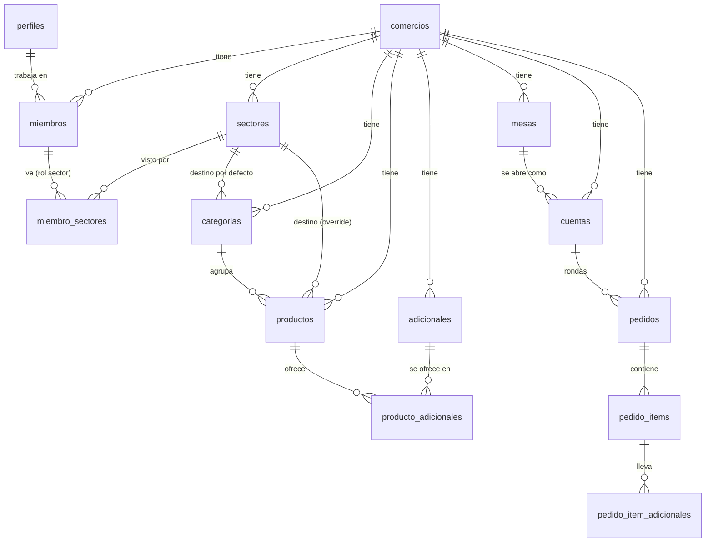
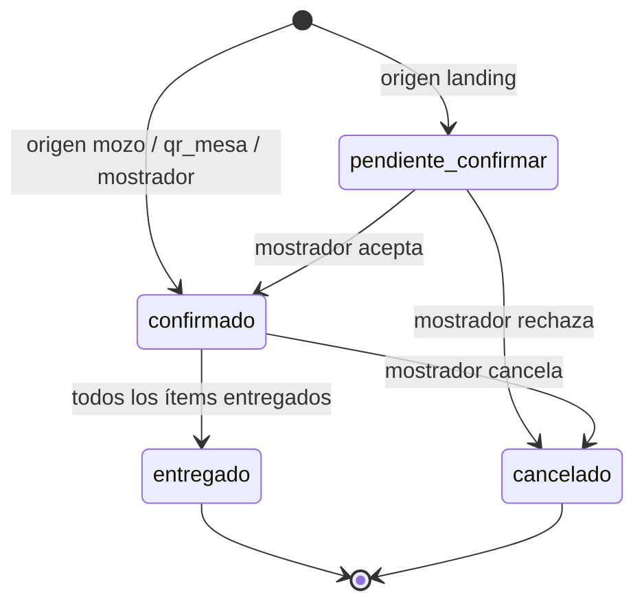

# Esquema de datos — SaaS gastronómico (Plan 1)

Contexto para desarrolladores y asistentes de IA. El SQL listo para Supabase está en `supabase/schema.sql`.

## Producto en una línea

App web multi-comercio (SaaS) para bares, restós y take away. Organiza pedidos y comandas. **No maneja pagos ni facturación.**

## Stack

- Next.js (App Router) + TypeScript
- Supabase: Postgres, Auth, Realtime, Row Level Security (RLS)
- Vercel (hosting)

## Reglas de oro

1. **Toda tabla de negocio lleva `comercio_id`.** Las políticas RLS filtran por ahí: un comercio nunca ve datos de otro.
2. **No se borra, se desactiva.** Productos, adicionales, mesas y usuarios usan `activo = false`. Los pedidos viejos siguen intactos.
3. **Los pedidos guardan copias** de nombre, precio y sector de productos y adicionales. Cambiar la carta no altera el historial.
4. **El plan del comercio decide qué se ve y qué se permite.** No se mueven ni borran datos al cambiar de plan.
5. **No hay pagos online.** Los comercios los crean los admins (nosotros) y activan/suspenden el plan a mano.

## Planes

| Plan | Take away / delivery | Salón (mesas, mozos, QR) |
| --- | --- | --- |
| `take_away` | Sí | No |
| `salon` | No | Sí |
| `completo` | Sí | Sí |

- Todos incluyen: roles, carta, adicionales, sectores y pantallas por sector.
- Límite de usuarios activos: **10 por defecto** (`comercios.limite_usuarios`). Los admins lo suben a 15/20 si el local paga el extra.

### Cambio de plan (bajar)

- **Pierde salón:** mesas e historial quedan ocultos. El admin no puede cambiar el plan si hay `cuentas` abiertas.
- **Pierde take away:** la landing muestra "no disponible". El admin no puede cambiar el plan si hay pedidos `pendiente_confirmar`.
- **Roles que ya no aplican** (ej. `mozo` en plan `take_away`): no pueden entrar y **no cuentan** para el límite.
- **Baja del límite de usuarios:** no se desactiva a nadie automáticamente; el dueño no puede crear nuevos hasta quedar por debajo.
- Si el local vuelve a subir de plan, recupera todo tal cual.

### Comercio suspendido

`comercios.estado = 'suspendido'` → sus usuarios no acceden a datos (RLS) y la app muestra un aviso. La landing pública muestra "no disponible".

## Roles

| Rol | Qué hace |
| --- | --- |
| `duenio` | Todo en su comercio: carta, mesas, usuarios, pedidos |
| `mostrador` | Confirma/rechaza pedidos de la landing, edita y cancela pedidos, entrega take away |
| `mozo` | Abre/cierra mesas, carga rondas, escanea QR, marca ítems entregados |
| `sector` | Ve la pantalla y cambia el estado de los ítems de los sectores que tiene asignados |

- Los **admins** (`perfiles.es_admin`) son del equipo del producto, no de un comercio. Ven y gestionan todo desde el panel de administrador.
- Los admins crean el comercio y el usuario dueño. El dueño crea a su personal.
- Se permite compartir una cuenta entre dispositivos (ej. una cuenta de cocina en 2 tablets). Los mozos conviene que tengan cuenta propia para saber quién atendió cada mesa. No hay control de sesiones simultáneas.
- Un rol `sector` no ve todos los sectores por defecto: cada miembro se vincula a los sectores concretos que le tocan (`miembro_sectores`), así que "Juan cocina, María atiende la barra" son dos miembros con rol `sector` cada uno con su propia asignación. El dueño sí ve todos los sectores activos del comercio, sin necesidad de asignación explícita.
- `cocina` y `barra` existían como roles separados y quedaron obsoletos (reemplazados por `sector` + `miembro_sectores`, ver "Tablas"); el enum los conserva por limitación de Postgres pero no se usan más.

## Diagrama

## Tablas

### Base (sprint 1)

**`comercios`**: `id`, `nombre`, `slug` (único, para URLs: `/garage-grill`), `plan`, `estado` (`activo` | `suspendido`), `limite_usuarios` (10), `zona_horaria` (`America/Argentina/Buenos_Aires`), `hora_corte` (06:00), `creado_en`.

**`perfiles`**: `id` (= `auth.users.id`), `nombre`, `email`, `es_admin`, `creado_en`.

**`miembros`**: `id`, `comercio_id`, `perfil_id`, `rol`, `activo`, `creado_en`. Único por (`comercio_id`, `perfil_id`). Una persona puede estar en varios comercios.

### Carta (sprint 2)

**`sectores`**: `id`, `comercio_id`, `nombre` (libre: "Cocina", "Barra", "Parrilla", lo que haga falta), `orden`, `activo`. Todo comercio nace con "Cocina".

**`miembro_sectores`**: (`comercio_id`, `miembro_id`, `sector_id`), PK compuesta por `miembro_id` + `sector_id`. Qué sectores puede ver un miembro con rol `sector`. El dueño no necesita filas acá: ve todos los sectores activos igual.

**`categorias`**: `id`, `comercio_id`, `nombre`, `sector_id` (destino por defecto de sus productos), `orden`, `activo`.

**`productos`**: `id`, `comercio_id`, `categoria_id`, `nombre`, `descripcion`, `precio`, `imagen_url`, `sector_id`, `sin_stock`, `activo`, `orden`.

- `sin_stock = true` → se muestra en gris con "Sin stock" y no se puede pedir.
- `activo = false` → no se muestra.
- `sector_id`: la columna existe y la siguen usando las copias en `pedido_items` (a qué pantalla va cada ítem) y `crear_pedido_landing`, pero **la interfaz de administración del comercio siempre la deja en `null`** al crear o editar un producto. Decisión de negocio: un producto se prepara siempre en el sector de su categoría; si un local necesita que algo salga de otro sector, crea una categoría aparte para eso en vez de pisarle el sector a un producto puntual. Si en algún momento se necesita volver a permitir un sector propio por producto, la columna ya está lista.

**`adicionales`**: `id`, `comercio_id`, `nombre` ("Extra cheddar", "Sin cebolla"), `precio_extra` (0 si es gratis), `activo`. Se crean una vez y se reutilizan.

**`producto_adicionales`**: (`producto_id`, `adicional_id`). Qué adicionales ofrece cada producto.

Futuro (no Plan 1): grupos de adicionales con elección única ("Punto: jugoso / a punto / cocido").

### Salón y pedidos (sprints 3 a 6)

**`mesas`**: `id`, `comercio_id`, `nombre` ("Mesa 4"), `activo`, `orden`.

**`cuentas`** (mesa abierta): `id`, `comercio_id`, `mesa_id`, `mozo_id` (→ `perfiles`), `estado` (`abierta` | `cerrada`), `abierta_en`, `cerrada_en`. Solo una cuenta abierta por mesa.

**`pedidos`** (un pedido take away o una ronda de mesa): `id`, `comercio_id`, `jornada` (date), `numero` (visible, reinicia por jornada), `origen` (`landing` | `mozo` | `qr_mesa` | `mostrador`), `cuenta_id` (null en take away), `estado`, `cliente_nombre`, `cliente_telefono`, `modalidad` (`retiro` | `envio`), `direccion`, `nota`, `creado_por`, `creado_en`, `confirmado_en`, `cancelado_en`, `motivo_cancelacion`.

**`pedido_items`**: `id`, `comercio_id`, `pedido_id`, `producto_id`, `nombre` (copia), `precio_unitario` (copia), `cantidad`, `nota` ("bien cocida"), `sector_id` (copia: a qué pantalla va), `estado`, `listo_en`, `entregado_en`.

**`pedido_item_adicionales`**: `id`, `comercio_id`, `item_id`, `adicional_id`, `nombre` (copia), `precio_extra` (copia).

## Estados

### Pedido

- Las pantallas de sector solo muestran ítems de pedidos `confirmado`.
- El mostrador puede editar o cancelar un pedido aunque la cocina ya lo haya empezado. El `id` y el `numero` se mantienen.

### Ítem

`pendiente` → `en_preparacion` → `listo` → `entregado`

- El estado va **por ítem** para que cocina y barra avancen a su ritmo.
- Ejemplo: ronda con hamburguesa + fernet. La barra marca el fernet listo, el mozo lo lleva y lo marca entregado. La hamburguesa sigue en cocina. Cuando todos los ítems están `entregado`, el pedido pasa solo a `entregado` (trigger).
- En take away, el mostrador entrega todo junto cuando todos los ítems están `listo`.

## Numeración por jornada

- `numero` arranca en 1 cada **jornada**, no cada día calendario.
- Jornada = fecha local del comercio restando `hora_corte`. Con corte 06:00, un pedido de las 02:00 del sábado pertenece a la jornada del viernes.
- Lo asigna un trigger con la tabla `contadores_pedidos` (sin carreras entre inserts simultáneos).

## Canales

### Landing pública (plan `take_away` o `completo`)

- URL: `/{slug}`. Muestra la carta activa. Pide nombre, teléfono, modalidad y dirección si es envío.
- No tiene opción de mesa.
- El cliente **no** escribe en tablas directamente: usa la función `crear_pedido_landing` (security definer), que valida plan, estado del comercio, stock y precios desde la base (nunca confía en precios del cliente).
- El pedido nace `pendiente_confirmar`.

### Pedido desde la mesa con QR (plan `salon` o `completo`)

- Cada mesa tiene un QR a `/{slug}/mesa/{mesa_id}` con la carta.
- El cliente arma el pedido en su celular **sin escribir en la base**. La app genera un QR con el carrito (ids de producto, cantidades, adicionales, notas).
- El mozo lo escanea desde su app; la app valida contra la base y crea la ronda en la cuenta abierta con `origen = 'qr_mesa'`.
- Ventaja: no hay pedidos anónimos ni spam en la base.

### Mozo

- Abre la cuenta de la mesa, carga rondas (incluso de un solo producto), marca ítems entregados y cierra la mesa.
- Si en el futuro se muestra el total de la cuenta al cliente, debe decir "Documento no válido como factura".

## Realtime

- Pantallas de sector: suscripción a `pedido_items` filtrando por `comercio_id` y `sector_id`.
- Mostrador y mozos: suscripción a `pedidos` y `pedido_items` del comercio.
- Cada pantalla abierta es una conexión. Supabase Pro incluye 500 simultáneas (~50-80 locales activos).

## Fuera del Plan 1

Promociones (2x1), grupos de adicionales, impresión de comandas, caja/cierres/reportes, stock por cantidades, pagos online, facturación.
